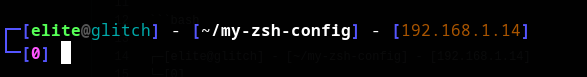
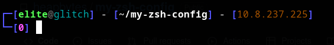

# my-zsh-config

A zsh theme that highlight ip address

- Generally, while creating payloads for reverse shell we need ip address, this following theme highlights the ip address

### eth0/ wlp6s0 ip highlight

### tun0 ip highlight

### How-to-use

- Install oh-my-zsh from <a href=https://ohmyz.sh/> here </a>

- Copy `.zsh-themes` to `~/.oh-my-zsh/themes/` with : `cp *.zsh-theme ~/.oh-my-zsh/themes/`

- Copy `.zshrc` in your home directory with `cp ~/.zshrc backup-old.zshrc && mv .zshrc ~/.zshrc`

- The default `.zshrc` file displays `tun0` ip address

- To set the ip address from `tun0` to private ip, set `ZSH_THEME` to `localip`

- To set the ip address from `eth0 /wlp6s0 ` to `tun0` ip, set `ZSH_THEME` to `tunip`

### Note

- The current zsh theme is simply a edit of `rkj` theme of `oh-my-zsh`

